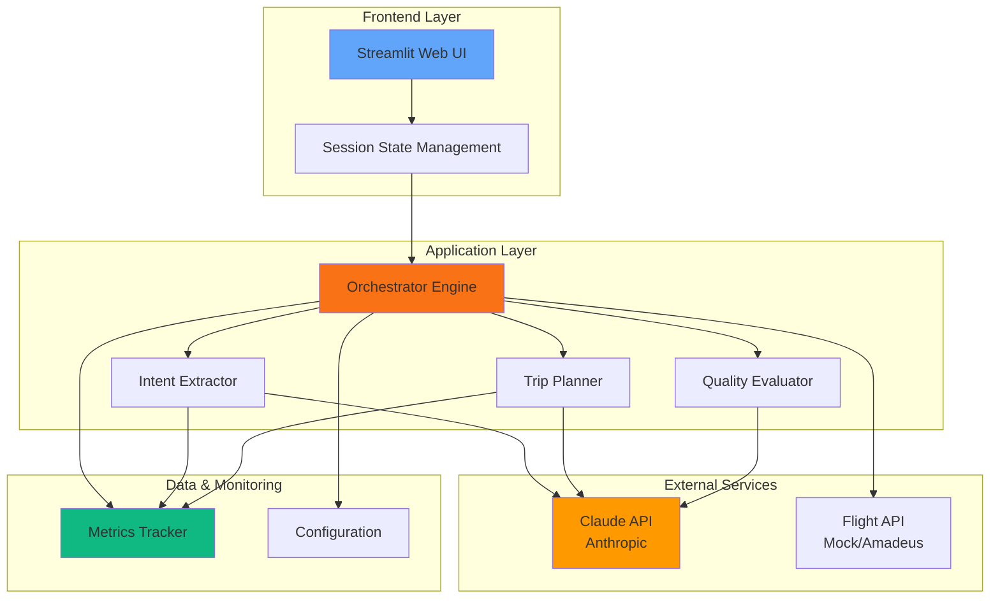
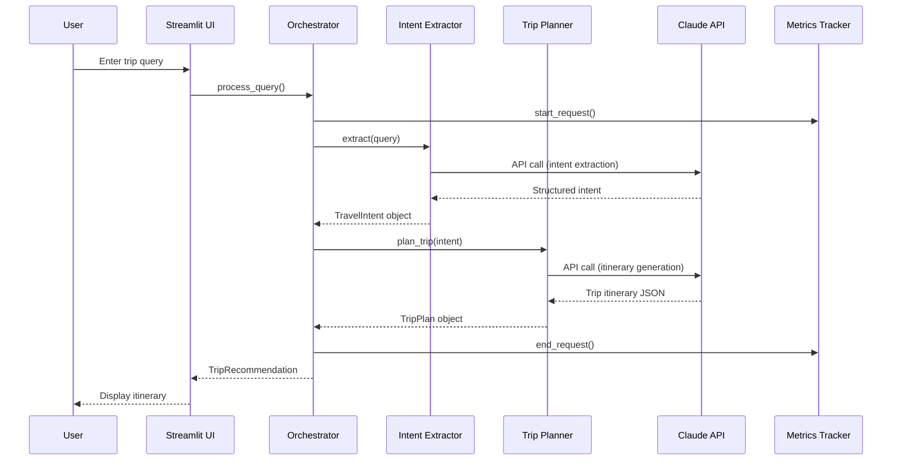
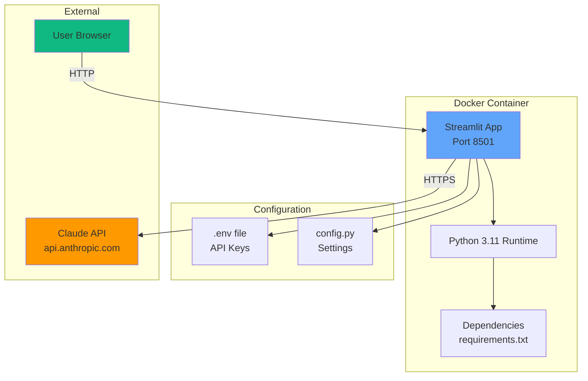
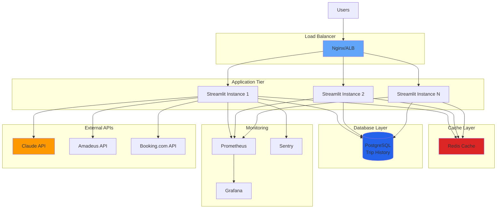
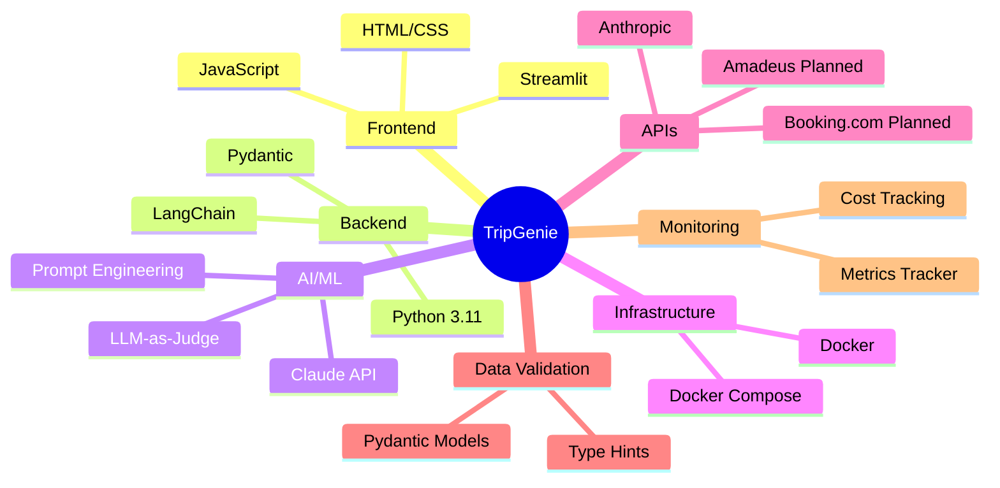

# TripGenie System Architecture

## High-Level Architecture

## Detailed Component Architecture

```mermaid
graph LR
    subgraph "User Input Processing"
        A[User Query] --> B[Intent Extraction]
        B --> C[Validation]
        C --> D{Valid?}
        D -->|Yes| E[Structured Intent]
        D -->|No| F[Error Response]
    end
    
    subgraph "Trip Generation"
        E --> G[Trip Planner]
        G --> H[Claude API Call]
        H --> I[Response Parsing]
        I --> J[Pydantic Validation]
        J --> K[Trip Plan Object]
    end
    
    subgraph "Enhancement"
        K --> L{Include Flights?}
        L -->|Yes| M[Flight Search]
        L -->|No| N[Skip Flights]
        M --> O[Flight Results]
        O --> P[Merge Data]
        N --> P
    end
    
    subgraph "Quality Check"
        P --> Q{Evaluate?}
        Q -->|Yes| R[LLM-as-Judge]
        Q -->|No| S[Skip Evaluation]
        R --> T[Quality Metrics]
        T --> U[Final Result]
        S --> U
    end
    
    U --> V[Display to User]
    
    style H fill:#FF9900
    style R fill:#FF9900
    style U fill:#10B981
```

## Data Flow Diagram

## Deployment Architecture (Current)

## Future Architecture (Planned)

## Tech Stack Overview

---

## Component Descriptions

### Frontend Layer
- **Streamlit UI**: Modern web interface with professional design
- **Session State**: Manages user state during session

### Application Layer
- **Orchestrator**: Main engine coordinating all components
- **Intent Extractor**: Parses natural language queries into structured data
- **Trip Planner**: Generates day-by-day itineraries using Claude
- **Evaluator**: Quality assessment using LLM-as-judge pattern

### External Services
- **Claude API**: Core AI engine for trip planning
- **Flight API**: Mock/Amadeus integration for flight search

### Data & Monitoring
- **Metrics Tracker**: Cost and performance monitoring
- **Configuration**: Environment-based settings management

---

## Design Patterns Used

- **Orchestrator Pattern**: Central coordination of all agents
- **Repository Pattern**: Data access abstraction (planned)
- **Factory Pattern**: Model creation and validation
- **Observer Pattern**: Metrics tracking
- **Strategy Pattern**: Flexible API selection (mock vs real)

---

## Scalability Considerations

**Current (MVP)**
- Single instance deployment
- In-memory session state
- Direct API calls

**Future (Production)**
- Horizontal scaling with load balancer
- Redis for distributed caching
- PostgreSQL for persistence
- Message queue for async processing
- CDN for static assets
